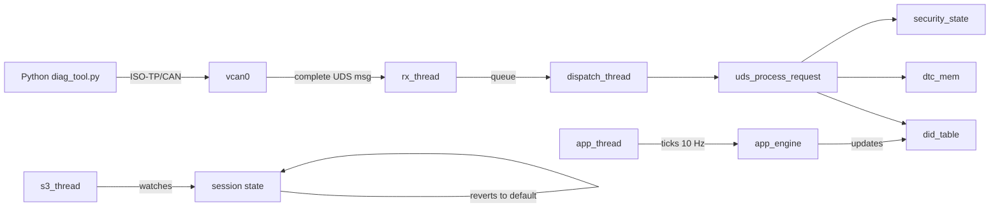

# vecu-uds — Virtual ECU with UDS (ISO 14229) over ISO-TP


A virtual automotive ECU written in C11/POSIX, implementing UDS diagnostic
services over a custom ISO-TP transport on Linux SocketCAN.

> Built in 21 days as a learning + portfolio project for **ingénieur
> embarqué automobile** roles (KPIT, Bosch, Continental, Vitesco,
> Stellantis, Forvia).

---

## TL;DR

```bash
# Build the ECU
cmake -S . -B build -DCMAKE_BUILD_TYPE=Release && cmake --build build

# Set up vcan + kernel modules
sudo modprobe vcan can-isotp
./scripts/setup_vcan.sh

# Run the ECU
./build/src/vecu_uds vcan0

# In another terminal, talk to it
cd client && pip install -r requirements.txt
./diag_tool.py read-vin
# VIN: VF1234567890ABCDE
```

## Architecture



The runtime spawns **four pthreads** sharing a `vecu_state_t` context.
Each sub-module owns its own mutex; access is documented in `include/vecu.h`.
The CAN-side I/O is provided by the kernel `can-isotp` module, so RX and
TX from two different threads on the same fd are safe.

## UDS services implemented

| SID  | Service                  | Sub-funcs | NRC handled                | Session req. | Security req. |
|------|--------------------------|-----------|----------------------------|--------------|---------------|
| 0x10 | DiagnosticSessionControl | 01/02/03  | 0x12, 0x13                 | any          | no            |
| 0x11 | ECUReset                 | 01/02/03  | 0x12, 0x13                 | any          | no            |
| 0x14 | ClearDiagnosticInfo      | —         | 0x13, 0x31                 | any          | no            |
| 0x19 | ReadDTCInformation       | 02        | 0x12, 0x13, 0x14           | any          | no            |
| 0x22 | ReadDataByIdentifier     | —         | 0x13, 0x14, 0x22, 0x31     | any          | no            |
| 0x27 | SecurityAccess           | 01/02     | 0x12, 0x13, 0x24, 0x35,    | extended     | —             |
|      |                          |           | 0x36, 0x37, 0x7F           |              |               |
| 0x2E | WriteDataByIdentifier    | —         | 0x13, 0x22, 0x31, 0x33,    | extended     | level 1       |
|      |                          |           | 0x7F                       |              |               |
| 0x3E | TesterPresent            | 00/80     | 0x12, 0x13                 | any          | no            |

## Data identifiers (DIDs)

| DID    | Sense                   | Type    | Notes                          |
|--------|-------------------------|---------|--------------------------------|
| 0xF190 | VIN                     | static  | 17 ASCII                       |
| 0xF18C | ECU serial              | static  | 12 ASCII                       |
| 0xF187 | Spare-part number       | static  | 8 ASCII                        |
| 0x010C | Engine RPM              | dynamic | 2 bytes, oscillates 800..2200  |
| 0x010D | Vehicle speed (km/h)    | dynamic | 1 byte, oscillates 10..110     |
| 0x0105 | Engine coolant (°C)     | dynamic | 1 byte, climbs to 92 then idle |
| 0xF200 | Owner name              | RW      | up to 32 ASCII, security gated |

## Repository layout

```
vecu-uds/
├── include/         # public headers
├── src/             # C implementation (~2000 lines)
│   ├── uds.c                — service dispatch + handlers
│   ├── isotp.c              — custom ISO-TP (educational)
│   ├── isotp_kernel.c       — kernel can-isotp wrapper (runtime)
│   ├── queue.c              — bounded producer/consumer queue
│   ├── threads.c            — 4 worker thread entry points
│   ├── did_table.c          — static + dynamic DID registry
│   ├── app_engine.c         — fake engine telemetry source
│   ├── dtc_mem.c            — DTC storage
│   ├── security.c           — seed/key SecurityAccess
│   └── ...
├── tests/           # C unit tests (ctest)
├── client/          # Python diag tool + pytest integration suite
├── docker/          # vECU + diag images
├── docs/            # comparison vs industrial ECU
├── scripts/         # setup_vcan.sh
└── CMakeLists.txt
```

## Build & run

```bash
cmake -S . -B build -DCMAKE_BUILD_TYPE=Debug
cmake --build build -j
ctest --test-dir build --output-on-failure   # C smoke tests
./build/src/vecu_uds vcan0                   # start the ECU
```

## Integration tests (Python)

```bash
cd client
pip install -r requirements.txt
pytest tests/
```

The pytest fixtures spawn the ECU binary, set up an ISO-TP socket, and
exercise every service + every NRC. ~20 tests, runs in <10 s.

## Docker

```bash
docker compose up --build vecu
docker compose run --rm diag read-vin
```

See `docker-compose.yml` for the (host networking, `NET_ADMIN`) caveats.

## What I learned

- **SocketCAN low-level**: opening `PF_CAN / CAN_RAW`, binding to an
  ifindex, and the difference with the higher-level `CAN_ISOTP`
  `SOCK_DGRAM` interface.
- **ISO 15765-2 segmentation**: SF / FF / CF / FC, the role of the
  Block Size and STmin fields, N_Cr timeout. Wrote it from scratch
  once to make sure I actually understood it.
- **ISO 14229 architecture**: SID, NRC, sessions, sub-function suppress
  positive bit, P2/P2\* timing parameters, the seed/key protocol and
  why it has a lock-out counter.
- **POSIX threading discipline**: documented lock order, mutex-per-
  resource, producer/consumer with `pthread_cond_t`, clean shutdown via
  `sig_atomic_t` + `pthread_cond_broadcast`.
- **Process-level integration testing**: spinning up the binary from
  pytest, talking to it over a real socket, asserting NRCs by code —
  exactly the validation discipline I practiced during the KPIT
  internship.
- **Where this work sits vs a real ECU**: see [`docs/comparison.md`](docs/comparison.md).

## Limitations (explicit, not hidden)

- The security algorithm is XOR with a constant — no real crypto.
- No bootloader, no flash programming services (0x34/0x36/0x37).
- ECUReset is logical (resets state machine), not a real reboot.
- No WCET guarantee — best-effort Linux scheduling.
- Not SAE J1979 / ISO 15031 compliant; PIDs are borrowed for demo only.

## License

MIT — see `LICENSE`.
